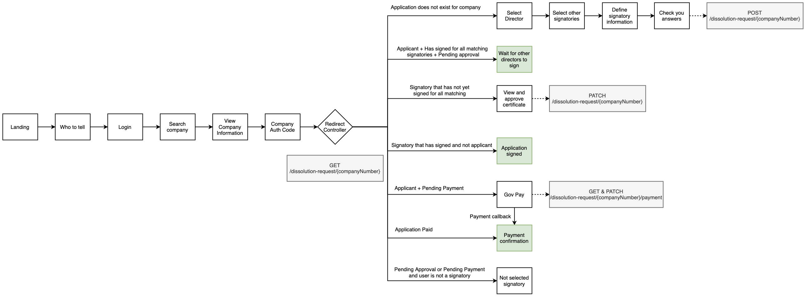

# Dissolution Web

This repo contains the frontend code for the dissolution web service.

## Technologies

- [NodeJS](https://nodejs.org/)
- [ExpressJS](https://expressjs.com/)
- [NunJucks](https://mozilla.github.io/nunjucks)
- [GulpJS](https://gulpjs.com/)
- [Inversify](https://github.com/inversify/)

## Recommendations

We recommend the use of [Visual Studio Code](https://code.visualstudio.com/) for development as it allows the installation of the [TSLint](https://marketplace.visualstudio.com/items?itemName=ms-vscode.vscode-typescript-tslint-plugin) and the [Nunjucks](https://marketplace.visualstudio.com/items?itemName=ronnidc.nunjucks) plugins. These plugins will make linting of TS and Nunjuck much better than mmost code editors.

IntelliJ does not have a Nunjuck plugin but you can configure IntelliJ to provide syntax highlighting using Twig plugin

## Running locally

1. Clone [Docker CHS Development](https://github.com/companieshouse/docker-chs-development) and follow the steps in the README.

2. Enable the `dissolution` module

3. Navigate to `http://chs.local/close-a-company/` to see the landing page

## To make local changes

Development mode is available for this service in [Docker CHS Development](https://github.com/companieshouse/docker-chs-development).

    ./bin/chs-dev development enable dissolution-web

## To build the Docker container

1. `export SSH_PRIVATE_KEY_PASSPHRASE='[your SSH key passhprase goes here]'` (optional, set only if SSH key is passphrase protected)
2. `DOCKER_BUILDKIT=0 docker build --build-arg SSH_PRIVATE_KEY="$(cat ~/.ssh/id_rsa)" --build-arg SSH_PRIVATE_KEY_PASSPHRASE -t 169942020521.dkr.ecr.eu-west-1.amazonaws.com/local/dissolution-web:latest -f Dockerfile_dev .`

## Controller flow

* GDS confirmation pages are in green
* Dissolution API endpoints are in grey
* At the end of each branch, redirect back to the Redirect Controller (except for payment callback)
* Enables save & resume-like functionality
* Enables consistency between single and multi director journeys
* Draw.io source code can be found [here](.github/images/DissolutionControllerFlow.drawio)
